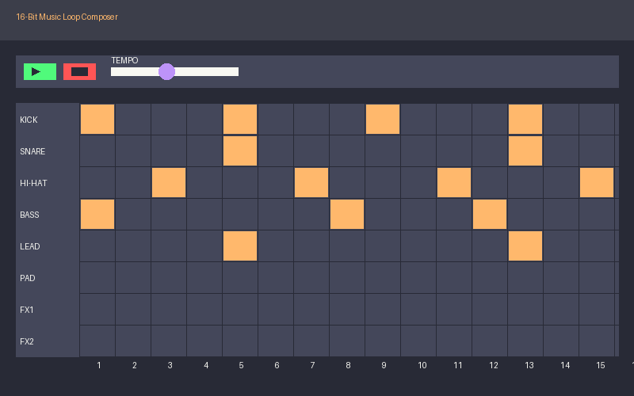
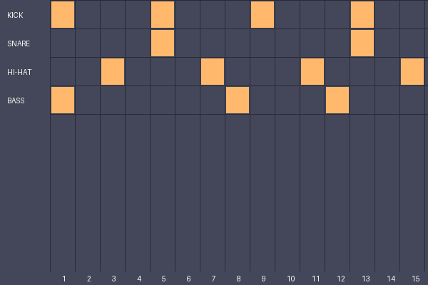
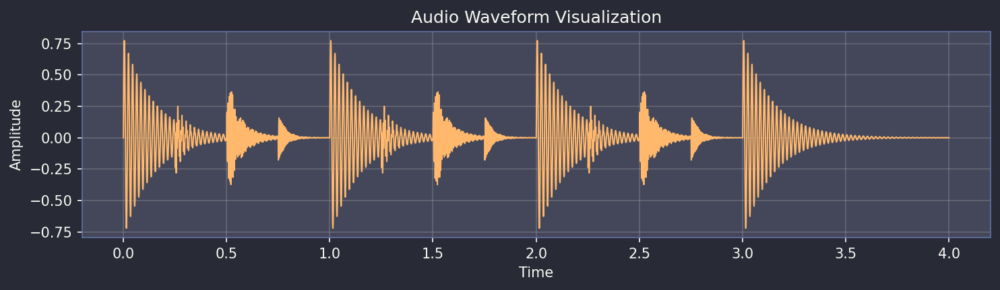

# 16-Bit Music Loop Composer



## Project Overview

The 16-Bit Music Loop Composer is a web-based music sequencer that captures the nostalgic essence of 16-bit era music production. This application allows users to create retro-style musical loops with an intuitive, grid-based interface reminiscent of classic music trackers from the 16-bit computing era.

### Key Features

- 16-step sequencer grid for precise pattern creation
- 8 instrument tracks with distinct 16-bit inspired sounds
- Real-time waveform visualization
- Authentic retro visual design with pixel-perfect aesthetics
- Web Audio API-powered sound engine for high-quality audio
- Responsive design that works across modern browsers

### Technologies Used

- **HTML5**: Semantic structure for accessibility and clear organization
- **CSS3**: Retro-inspired styling with modern techniques
- **JavaScript**: Core application logic and user interaction
- **Web Audio API**: High-performance audio processing and playback
- **Canvas API**: Real-time waveform visualization

## Installation and Setup

### Prerequisites

- A modern web browser (Chrome, Firefox, Safari, Edge)
- JavaScript enabled
- No additional dependencies or installations required

### Local Setup

1. Clone the repository:
   ```bash
   git clone https://github.com/yourusername/16-bit-music-loop-composer.git
   ```

2. Navigate to the project directory:
   ```bash
   cd 16-bit-music-loop-composer
   ```

3. Open `index.html` in your web browser:
   ```bash
   open index.html   # macOS
   # or
   start index.html  # Windows
   ```

4. Start creating music!

## User Guide

### Sequencer Interface

The main interface consists of a grid where:
- **Rows** represent different instrument tracks
- **Columns** represent the 16 steps in the sequence
- **Cells** can be toggled on/off to create patterns



### Instrument Tracks

The sequencer includes 8 distinct instrument tracks:

1. **Kick Drum**: Deep, punchy bass drum
2. **Snare**: Classic 16-bit snare sound
3. **Hi-Hat**: Crisp, digital hi-hat
4. **Bass**: Low-frequency synthesized bass
5. **Lead**: Melodic lead synthesizer
6. **Pad**: Atmospheric background sounds
7. **FX1**: Special effects and one-shots
8. **FX2**: Additional effects and percussion

### Playing the Sequencer

- Click the **Play** button to start the sequence
- Click the **Pause** button to stop playback
- Adjust the **Tempo** slider to change the speed
- Use the **Clear** button to reset the pattern

### Creating Patterns

1. Click on cells in the grid to activate/deactivate sounds
2. Build up patterns by enabling different steps for each instrument
3. Experiment with different combinations to create unique loops

### Waveform Visualization

The waveform display shows a real-time representation of your audio output:
- **X-axis**: Time
- **Y-axis**: Amplitude
- The visualization updates in real-time as your sequence plays



## Technical Implementation

### Application Architecture

The application follows a modular architecture with four main components:

1. **Audio Engine** (`audio-engine.js`)
   - Manages the Web Audio API context
   - Handles sample loading and playback
   - Controls audio routing and processing

2. **Sequencer** (`sequencer.js`)
   - Manages the step sequencing logic
   - Controls timing and playback
   - Coordinates with the audio engine for sound triggering

3. **UI Controller** (`ui-controller.js`)
   - Handles user interactions
   - Updates the visual interface
   - Manages state between the UI and audio components

4. **Waveform Visualizer** (`visualizer.js`)
   - Creates real-time audio visualization
   - Uses Canvas API for rendering
   - Analyzes audio output for display

### Web Audio API Implementation

The application leverages modern Web Audio API features:

- Single `AudioContext` for efficient audio management
- `AudioBufferSourceNode` for sample playback
- `OscillatorNode` for synthesized sounds
- `AnalyserNode` for waveform visualization
- Precise scheduling using the Web Audio clock

#### Audio Scheduling

The sequencer uses a look-ahead scheduling technique:
- Schedules audio events slightly in advance
- Uses the Web Audio API's precise timing capabilities
- Avoids timing issues common with `setTimeout` or `setInterval`

```javascript
// Example scheduling code (simplified)
function scheduleNotes(startTime) {
  const currentStep = sequencer.currentStep;
  
  // Schedule all active notes for this step
  for (let track = 0; track < 8; track++) {
    if (sequencer.pattern[track][currentStep]) {
      audioEngine.playSound(track, startTime);
    }
  }
}
```

### 16-Bit Audio Implementation

The application uses 16-bit audio samples for authentic retro sound:
- 44.1kHz sample rate for high-quality playback
- Carefully processed samples to match 16-bit era characteristics
- Optimized for web playback performance

## Future Enhancements

Future versions of the 16-Bit Music Loop Composer could include:

1. **Pattern Storage**
   - Save and load patterns
   - Export to common audio formats

2. **Extended Instruments**
   - More instrument options
   - Custom sample upload

3. **Advanced Effects**
   - Delay, reverb, and filter effects
   - Per-track audio processing

4. **Expanded Sequencer**
   - Longer patterns (32/64 steps)
   - Multiple patterns with chaining

5. **Mobile Support**
   - Touch-optimized interface
   - Responsive design for smaller screens

## Accessibility

The 16-Bit Music Loop Composer is designed with accessibility in mind:

- Semantic HTML structure
- Keyboard navigation support
- ARIA attributes for screen readers
- High contrast visual design
- Clear visual feedback for all interactions

## Browser Compatibility

The application is tested and optimized for:
- Chrome 100+
- Firefox 95+
- Safari 15+
- Edge 90+

## Contributing

Contributions to the 16-Bit Music Loop Composer are welcome! Please feel free to submit pull requests or open issues for bugs and feature requests.

## License

[MIT License](LICENSE)

---

Created with ♥ for the love of retro music and web audio technology.